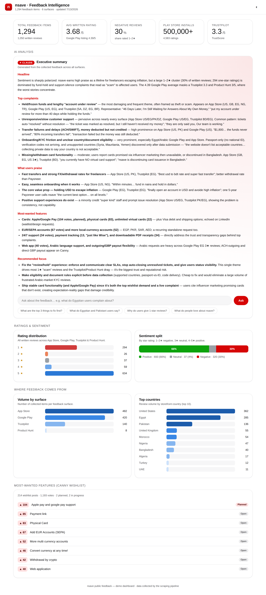
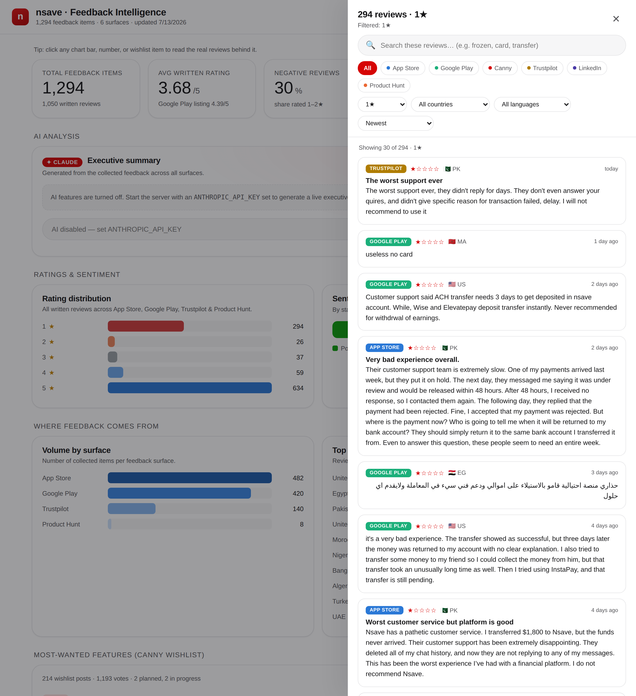
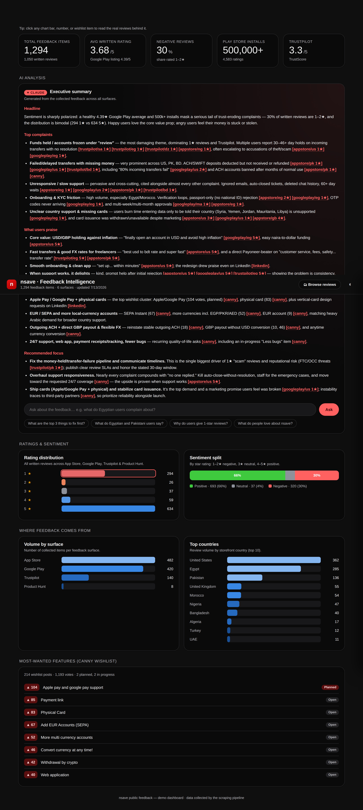

# nsave · Feedback Intelligence

**One place to see everything nsave's users are saying — and ask Claude about it.**

This tool collects nsave's public user feedback from every scrapeable surface,
normalizes it into a single dataset, and presents it in an nsave-themed dashboard
with a Claude-powered analyst built in. It turns feedback that is currently
scattered across seven platforms and three languages into a live, queryable
picture of what users love, what's breaking their trust, and what they're asking
for next.

**~1,294 feedback items across 6 surfaces** — App Store, Google Play, Trustpilot,
Product Hunt, a Canny wishlist board, and curated public LinkedIn comments.

**▶ Live demo: [nsave-feedback-intelligence.vercel.app](https://nsave-feedback-intelligence.vercel.app)**



---

## Why I built this (the problem)

> Built for the nsave **Operational Hometask**: *"Build one thing that moves the
> mission forward… we care more about internal tooling than customer-facing
> features — an automation that saves the team hours every week."*

nsave's mission is to give people in unstable economies safe accounts to save,
spend, and invest. For that audience, **trust is the product.** A user in Cairo or
Karachi deciding whether to move their savings into nsave is making a leap of faith
— and the single biggest thing that breaks that faith is the fear of money getting
stuck or an account being frozen with no explanation.

That signal is loud, but it's **scattered and invisible to the team**:

- It lives on **seven different platforms** — two app stores (each split into
  per-country storefronts), Trustpilot, Product Hunt, a Canny board, LinkedIn — with
  no shared view.
- It's **multilingual** — English, Arabic, Bengali, French — so a lot of it never
  gets read by the people who could act on it.
- The **headline numbers lie**: the Google Play rating is 4.39, but that average
  hides a Trustpilot of 3.3 and the fact that **30% of everyone who bothers to write
  a review gives 1–2 stars**. Nobody is watching the gap between the star rating and
  what the text actually says.
- Reading it all manually — hundreds of reviews a week, across languages and sites —
  is exactly the painful, repetitive work that never gets done consistently.

So the ops / support / product team is flying partially blind on the thing that
most directly threatens the mission.

## What this tool does

It's the internal-leverage layer for that problem:

1. **Collects** feedback from every public surface automatically (App Store &
   Google Play via official/community APIs; Trustpilot, Product Hunt & Canny via
   headless browser; LinkedIn hand-curated for legal reasons).
2. **Unifies** it into one normalized dataset with per-surface, per-country, and
   per-rating breakdowns.
3. **Visualizes** it in a dashboard: rating distribution, sentiment split, where
   feedback comes from geographically, and the top feature requests by vote.
4. **Analyzes** it with Claude — an executive summary on load, plus a chat box that
   answers plain-English questions (*"What do Egyptian users complain about?"*)
   grounded strictly in the real reviews, citing which surfaces back each point.

## How it helps nsave

- **Early warning on trust-breakers.** The tool surfaces "frozen funds / account
  under review" as the #1 complaint across App Store, Google Play *and* Trustpilot —
  the theme most likely to make a user call nsave a scam. Catching a spike here
  before it hits the ratings is worth more than any feature.
- **Hours saved every week.** What is currently an unstructured manual read of
  hundreds of multilingual reviews becomes a 30-second glance plus a question box.
- **A shared source of truth.** Support sees recurring pain, product sees the ranked
  wishlist (Apple/Google Pay, physical cards, EUR/SEPA), leadership sees the trend —
  all from the same data.
- **Market-aware.** Because everything is tagged by country, the team can see that
  the complaints concentrate in exactly its target markets (Egypt, Pakistan,
  Bangladesh, Nigeria), not in noise from elsewhere.

## Why it matters

For a fintech serving people who have *already* been failed by their local banks,
a single "they're holding my money" story spreading is existential. The teams that
keep nsave trustworthy are the ops and support people in the internal-leverage
layer — and they can only act on what they can see. This tool makes the users'
collective voice visible and queryable, so problems get caught and fixed while
they're still small.

---

## How to use it

### 1. Run the dashboard

```bash
npm install

# The collected data is already committed in data/, so you can run immediately:
export ANTHROPIC_API_KEY=sk-ant-...   # optional — turns on the AI features
npm run dashboard                     # http://localhost:3000
```

- **Without a key**, everything runs except the AI panel (which shows a "set the
  key" notice) — all charts and KPIs work off the committed data.
- **With a key**, the executive summary generates on load and the ask box answers
  questions.

### 2. (Optional) Re-collect fresh data

```bash
npm run collect              # all automated collectors + rebuild the summary
npm run collect:appstore     # App Store only (iTunes RSS, 17 storefronts)
npm run collect:googleplay   # Google Play only (10 lang/country locales)
npm run collect:canny        # Canny wishlist (headless Chromium)
npm run collect:producthunt  # Product Hunt (headless Chromium)
npm run collect:trustpilot   # Trustpilot (headless Chromium, demo-only)
npm run summarize            # rebuild data/summary.json from disk
```

### 3. Ask the AI things

Type a question in the dashboard, or use a suggested one:
*"What are the top 3 things to fix first?"*, *"Why do users give 1-star reviews?"*,
*"What do Egyptian and Pakistani users say?"* Answers are grounded only in the
collected feedback and name the surfaces behind each point.

## Deploy to Vercel

A live instance runs at
**[nsave-feedback-intelligence.vercel.app](https://nsave-feedback-intelligence.vercel.app)**.
At runtime the app is just static HTML plus three lightweight endpoints reading
committed JSON and calling Claude (the headless-browser collectors are dev-time only
and never run in production), which is why it deploys cleanly to Vercel.

```bash
npm i -g vercel
vercel                                       # link & deploy a preview
vercel env add ANTHROPIC_API_KEY             # paste your key (Production)
vercel --prod                                # deploy to production
```

Or import the GitHub repo at [vercel.com/new](https://vercel.com/new) and add
`ANTHROPIC_API_KEY` in **Settings → Environment Variables**. No build step or
framework preset is needed.

**How it maps to Vercel** (see `vercel.json`):

- `public/index.html` → served statically at `/`.
- `api/data.js`, `api/summary.js`, `api/ask.js` → serverless functions.
- `data/**` is bundled into the functions via `includeFiles`, so the deployed app
  serves the committed dataset with no scraping at runtime.

---

## Where the data lives

All collected feedback is stored as JSON in the **`data/` directory, committed to
this repo**, so the app runs immediately after cloning:

| File | Contents |
|---|---|
| `data/appstore.json` | 482 App Store reviews (17 storefronts) |
| `data/googleplay.json` | 420 Google Play reviews + listing metadata |
| `data/trustpilot.json` | 140 Trustpilot reviews |
| `data/producthunt.json` | 8 Product Hunt reviews |
| `data/canny.json` | 214 Canny wishlist posts + votes/status |
| `data/linkedin-curated.json` | 6 posts, 30 curated public comments |
| `data/summary.json` | Combined cross-surface summary |

Reviews share a normalized schema: `source, id, country, lang, rating, title, text,
author, date, appVersion, thumbsUp`.

## Feedback surfaces

| Surface | Volume collected | Approach | Risk |
|---|---|---|---|
| Apple App Store (id 6471736519) | 482 reviews, 17 storefronts | Free iTunes RSS reviews feed | Low |
| Google Play (`com.nsave.app`) | 420 reviews; 4.39/5, 500k+ installs | `google-play-scraper` | Low–medium |
| Trustpilot | 140 reviews, TrustScore 3.3 | Headless Chromium (`__NEXT_DATA__`), demo-only | High |
| Canny (nsave.canny.io) | 214 wishlist posts, 1,193 votes | Headless Chromium (intercepts `/api/posts/get`) | Low |
| Product Hunt | 8 reviews, 3.0/5 | Headless Chromium (Cloudflare-fronted) | Low–medium |
| LinkedIn | 6 posts, 30 comments | Curated / owner-authorized only — [research](docs/linkedin-research.md) | Highest |
| Reddit | none — no indexed content | Skipped | — |

LinkedIn is deliberately **not** automated — its ToS prohibit scraping and LinkedIn
actively litigates; the fixture is hand-curated from public logged-out post pages.
See [`docs/linkedin-research.md`](docs/linkedin-research.md).

## The dashboard

- **Themed after [nsave.com](https://www.nsave.com)** — white surfaces, near-black
  ink, the nsave crimson accent (`#d60505`), a Suisse-style grotesque font, built on
  Material Design 3 tokens. Light + dark themes (dark is stepped for the dark
  surface, not an inverted flip); responsive.
- **Charts** are hand-built SVG/CSS on a colourblind-validated palette with every
  bar directly labelled: rating distribution (diverging red→blue), sentiment split,
  volume by surface and country, and the Canny wishlist.
- **AI** is backed by `claude-opus-4-8` via the official Anthropic SDK, grounded in
  a compact corpus (`src/dashboard/aggregate.js` → `buildCorpus`) sampled from the
  real reviews, Canny asks, and LinkedIn comments plus the aggregate stats.

### Reviews explorer — read the real feedback behind every number

Every chart bar, KPI, and wishlist item is clickable: click "1★ · 294" or "Egypt ·
285" or a surface bar and a side drawer slides in with the actual reviews behind it.
Inside the drawer you can full-text search, filter by surface, rating, country, and
language, and sort — with each review shown as a card (source badge, star rating,
country flag, date, and text; Arabic/Bengali render right-to-left, and a "nsave
replied" marker shows where the company responded). **The AI's citations are
clickable too** — when the summary says a theme appears on `[trustpilot/eg 1★]`,
clicking it opens the drawer on exactly those reviews, so every AI claim is one tap
from its evidence. Served by `GET /api/reviews` (filter / search / paginate over the
committed dataset; `src/dashboard/reviews.js`).





## Architecture

```
public/index.html               the single-page dashboard (served statically)
api/{data,summary,ask,reviews}.js  Vercel serverless endpoints
src/dashboard/
  aggregate.js                  reads data/ → chart aggregates + AI grounding corpus
  reviews.js                    unified review index (filter/search/paginate)
  ai.js                         Anthropic SDK calls (summary + grounded Q&A)
  server.js                     local Express server (npm run dashboard)
src/collectors/*.js        the scrapers (dev-time data collection)
data/*.json                the committed dataset
```

The same `aggregate.js` / `ai.js` power both the local Express server and the Vercel
functions, so local dev and production behave identically.

## What the data shows

Sentiment is sharply polarized. The 4.39 Google Play average masks a Trustpilot 3.3
and Product Hunt 3.0, and **30% of written reviews are 1–2★**. The dominant
complaints — consistent across App Store, Google Play, and Trustpilot — are frozen
funds and long "account under review" holds, unresponsive support, and failed/stuck
transfers, concentrated in the Egyptian, Pakistani, and Bangladeshi markets. Praise
centres on fast transfers, strong FX rates, and escaping local inflation. The Canny
board's top asks are Apple/Google Pay (104 votes, planned), payment links, and
physical cards.

## What I'd do next (with a week and a small budget)

- **Alerting**, not just a dashboard: a daily digest to Slack, and a page when 1★
  volume or a specific theme (e.g. "frozen") spikes.
- **Automatic theme tagging** of every incoming review with Claude, tracked over
  time, so you see themes trending up or down week over week.
- **Ticket linkage**: cross-reference public complaints with the support system to
  measure how many turn into resolved tickets — closing the loop from signal to fix.
- **Internal-only surfaces**: point the same pipeline at in-app NPS, support
  transcripts, and churn-survey free-text, which carry the richest signal of all.

## Docs

- [LinkedIn feedback-surface research](docs/linkedin-research.md)
- Dashboard screenshots: [`docs/screenshots/`](docs/screenshots/)
